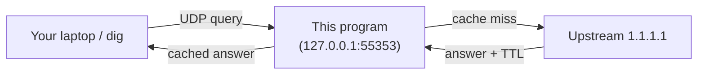

# Mini DNS Resolver

A small **forwarding DNS stub resolver** written in Python.
It listens for DNS queries on your machine, checks an in-memory cache, and
forwards cache misses to a real upstream resolver (e.g. Cloudflare `1.1.1.1`).
Answers are cached with proper **TTL** handling so repeat lookups are instant.

---

## Quick start (< 2 minutes)

```bash
# 1. Clone and set up
git clone <this-repo>
cd Mini-DNS-Resolver-with-Caching-and-TTL-Semantics
python3 -m venv .venv
source .venv/bin/activate          # Windows: .venv\Scripts\activate
pip install -r requirements.txt

# 2. Launch the interactive menu
python run.py
```

**Advanced:** to run the resolver **without** the menu, stay in the **repository root** and use either:

```bash
python server.py --port 55353 --upstream 1.1.1.1
# same effect:
python -m src.server --port 55353 --upstream 1.1.1.1
```

The real implementation lives in **`src/`**. The root `server.py` is a small launcher so older docs and copy-paste still work. **Do not** run `python src/server.py` — that sets the wrong import path and fails with `No module named 'src'`.

Pick **option 1** ("Start the resolver — basic, UDP upstream").
The script finds a free port, starts the server, and prints `dig` commands
(with **`+time=8`**) you can paste in a **second terminal** to test it.



## Why every dig example uses +time=8

ISC `dig` defaults to **`+time=5`**: it stops waiting for a UDP answer after **5 seconds per try**.

This resolver’s upstream path uses **`--timeout 5`** (seconds) by default (`src/server.py`). When upstream fails (for example **DoT** blocked on TCP **853**), the stub finishes work at about **5001–5010 ms** and then sends **SERVFAIL** back to `dig`.

If your `dig` line only uses the default 5 s wait, **`dig` can time out at ~5.0 s while the server replies at ~5.003 s**. You see **`;; connection timed out; no servers could be reached`**, which looks like “nothing is listening,” even though the server is up and logged **`[ERROR] … Upstream timeout or protocol failure`**.

**Fix:** pass **`+time=8`** (or any value **strictly greater** than the server’s upstream timeout). Then you reliably see either **NOERROR** with answers or **SERVFAIL** — not a spurious timeout. All commands from `python run.py` and the README use **`+tries=1 +retry=0 +time=8`** for that reason.

---

## Feature walkthroughs

Every section below follows the same pattern: **what** the feature does,
**how to test it**, **what you should see**, and a short **explanation**.

> **Tip:** Most features can be tested via `python run.py` (choose the
> relevant menu option) plus a `dig` command in a second terminal. Run
> every command from the **repository root** (the directory that contains
> `run.py` and `src/`). All
> `dig` lines use **`+time=8`** so the client waits longer than the server’s
> default **5 s** upstream timeout — see **Why every dig example uses +time=8** above.

---
### Feature 1: Cache hit vs. miss (cold / warm)

**What it does** — The first query for a name is a *cache miss*: the
resolver contacts upstream. The second query for the same name is a
*cache hit*: answered from RAM in under a millisecond.

**How to test it**

1. `python run.py` → option **1** (basic resolver).
2. In a second terminal:

```bash
# First query — cold (miss)
dig @127.0.0.1 -p 55353 example.com A +tries=1 +retry=0 +time=8

# Same query — warm (hit)
dig @127.0.0.1 -p 55353 example.com A +tries=1 +retry=0 +time=8
```

**What you should see** (server terminal)

```
[CACHE_MISS]  42.17ms upstream=1.1.1.1 qname=example.com. qtype=A
[CACHE_HIT]    0.08ms upstream=1.1.1.1 qname=example.com. qtype=A
```

**`dig` (stdout)** — each run should report **`status: NOERROR`**, an
**`ANSWER SECTION`** with an A record for `example.com`, and a small
**`Query time`** on the second run (often under 5 ms when served from cache).

**What just happened** — The first lookup went to `1.1.1.1` and took
~40 ms. The answer was stored in cache keyed by `(example.com., A)` with
the TTL from the upstream answer. The second lookup found it in cache and
replied instantly.

---

### Feature 2: TTL expiry

**What it does** — Cached entries expire when their TTL runs out.
After expiry the next query is a miss again.

**How to test it**

1. Start the server with a short demo TTL cap:

```bash
python server.py --port 55353 --upstream 1.1.1.1 --demo-max-ttl 5
```

2. In a second terminal:

```bash
dig @127.0.0.1 -p 55353 example.com A +tries=1 +retry=0 +time=8   # miss → cached
sleep 6
dig @127.0.0.1 -p 55353 example.com A +tries=1 +retry=0 +time=8   # miss again (TTL expired)
```

**What you should see**

```
[CACHE_MISS]  38.50ms  …
# (6 seconds later)
[CACHE_MISS]  35.12ms  …
```

**What just happened** — `--demo-max-ttl 5` caps every cached entry at
5 seconds. After sleeping 6 seconds the entry expired, so the resolver
contacted upstream again.

---

### Feature 3: TCP fallback on truncation

**What it does** — If the upstream UDP response has the **TC**
(truncated) flag set, the resolver automatically retries over **TCP** to
get the full answer.

**How to test it**

```bash
python run.py        # option 5 or 6 (the demo includes an injected TC test)
```

**What you should see**

```
Scenario 3: UDP returns TC → TCP retry (offline injected mocks)
[TCP_FALLBACK]  …
Injected TC path OK (tcp_fallback=True, upstream_latency≈0.15 ms)
```

**What just happened** — The demo injected a fake truncated UDP response.
The resolver detected `TC=1`, retried over TCP, and received the full
answer — all logged with `[TCP_FALLBACK]`.

---

### Feature 4: Negative caching (NXDOMAIN and NODATA)

**What it does** — When upstream says a domain does not exist
(**NXDOMAIN**) *or* exists but has no records of that type
(**NODATA** — NOERROR with an empty answer), the resolver caches that
fact so it does not hammer upstream for the same non-answering name.
Both cases use the SOA `minimum` TTL (capped at 300 s) per RFC 2308.

**How to test it**

1. `python run.py` → option **1**.
2. In a second terminal — run each command **twice**:

```bash
# NODATA case: the subdomain does not have an A record (NOERROR + SOA authority)
dig @127.0.0.1 -p 55353 doesnotexist.example.com A +tries=1 +retry=0 +time=8
dig @127.0.0.1 -p 55353 doesnotexist.example.com A +tries=1 +retry=0 +time=8

# NXDOMAIN case: the domain truly does not exist
dig @127.0.0.1 -p 55353 nxdomain.test A +tries=1 +retry=0 +time=8
dig @127.0.0.1 -p 55353 nxdomain.test A +tries=1 +retry=0 +time=8
```

**What you should see** (server stderr)

```
[CACHE_MISS]  82.00ms upstream=1.1.1.1 qname=doesnotexist.example.com. qtype=A
[CACHE_HIT]    0.18ms upstream=1.1.1.1 qname=doesnotexist.example.com. qtype=A
[CACHE_MISS]  55.30ms upstream=1.1.1.1 qname=nxdomain.test. qtype=A
[CACHE_HIT]    0.08ms upstream=1.1.1.1 qname=nxdomain.test. qtype=A   negative
```

`dig` stdout for the **NODATA** case (both queries):

```
;; ->>HEADER<<- opcode: QUERY, status: NOERROR, id: 12345
;; flags: qr rd ra; QUERY: 1, ANSWER: 0, AUTHORITY: 1, ADDITIONAL: 0

;; AUTHORITY SECTION:
example.com.   1728  IN  SOA  elliott.ns.cloudflare.com. dns.cloudflare.com. ...

;; Query time: 82 msec   ← first query (cache miss)
;; Query time: 0 msec    ← second query (cache hit)
```

`dig` stdout for the **NXDOMAIN** case:

```
;; ->>HEADER<<- opcode: QUERY, status: NXDOMAIN, id: 23456
;; flags: qr rd ra; QUERY: 1, ANSWER: 0, AUTHORITY: 0, ADDITIONAL: 0

;; Query time: 55 msec   ← first query (cache miss)
;; Query time: 0 msec    ← second query (cache hit)
```

**What just happened**

- **NODATA** (`doesnotexist.example.com`): `example.com`'s DNS server
  returns NOERROR with an SOA in the authority section — it confirms the
  subdomain has no A record. The resolver cached this response for the
  SOA minimum TTL (typically ~30–60 s). The second query was served from
  cache instantly.
- **NXDOMAIN** (`nxdomain.test`): The `.test` TLD truly does not exist,
  so upstream returns NXDOMAIN. The resolver cached that as a negative
  entry. The second query returned the cached NXDOMAIN instantly.

---

### Feature 5: DNS-over-TLS (DoT)

**What it does** — Encrypts the upstream hop using TLS on port **853**
instead of plain UDP to `1.1.1.1:53`. The stub still speaks **UDP** to
your machine (`dig` → `127.0.0.1`); only the link to Cloudflare is DoT.

**How to test it**

```bash
python run.py        # option 2 (DoT upstream)
```

Wait until you see `Listening UDP … protocol=dot`, then in a second
terminal (commands include **`+time=8`** — see the section **Why every dig example uses +time=8** above):

```bash
dig @127.0.0.1 -p 55353 example.com A +tries=1 +retry=0 +time=8
dig @127.0.0.1 -p 55353 cloudflare.com AAAA +tries=1 +retry=0 +time=8
```

#### When DoT works (outbound TCP 853 allowed)

**Server (stderr)** — first query then repeat:

```
Listening UDP 127.0.0.1:55353 upstream=1.1.1.1 protocol=dot demo_ttl_cap=None
[CACHE_MISS]  45.20ms upstream=1.1.1.1 qname=example.com. qtype=A
[CACHE_HIT]    0.12ms upstream=1.1.1.1 qname=example.com. qtype=A
```

**`dig` (stdout)** — abbreviated; you should see **`status: NOERROR`**
and an **`ANSWER SECTION`** with at least one A record:

```
;; ->>HEADER<<- opcode: QUERY, status: NOERROR, id: ...
;; flags: qr rd ra; QUERY: 1, ANSWER: 1, ...
;; ANSWER SECTION:
example.com.            300     IN      A       93.184.216.34
```

#### When TCP 853 is blocked or upstream cannot be reached

This is **normal on some networks** (guest Wi‑Fi, corporate firewalls,
some ISPs). The stub is still listening on UDP locally; it simply cannot
complete TLS to `1.1.1.1:853` before **`--timeout` (5 s)** elapses.

**Server (stderr)** — each query ends with:

```
[ERROR] 5003.53ms upstream=1.1.1.1 qname=example.com. qtype=A Upstream timeout or protocol failure
```

**`dig` (stdout)** — with **`+time=8`** you should see **`SERVFAIL`**
(not a client-side timeout):

```
;; ->>HEADER<<- opcode: QUERY, status: SERVFAIL, id: ...
;; flags: qr rd ra; QUERY: 1, ANSWER: 0, ...
;; Query time: 5003 msec
;; SERVER: 127.0.0.1#55353(127.0.0.1)
```

If you omit **`+time=8`** and rely on `dig`’s default **`+time=5`**, you
may instead get **`;; connection timed out; no servers could be reached`**
because **`dig` stops waiting at ~5.0 s** while the server sends
**SERVFAIL** a few milliseconds **after** that (see the section above).
That is a **client timeout race**, not proof that the resolver is down.

**What to do on blocked 853** — Use **`python run.py` → option 1** (UDP
upstream) or **option 3** (DoH on port 443).

**What just happened (TLS details)** — For Cloudflare’s anycast IPs
(`1.1.1.1` / `1.0.0.1`), the resolver sets TLS **SNI** to
`cloudflare-dns.com` so the certificate matches the connection. Other
resolver IPs accept **`--dot-server-name`** on the CLI.

---

### Feature 6: DNS-over-HTTPS (DoH)

**What it does** — Sends upstream queries as HTTPS POST requests
to a DoH endpoint (default `https://1.1.1.1/dns-query`). DoH requires
the `h2` HTTP/2 library in addition to `httpx` — both are in
`requirements.txt`.

**How to test it**

```bash
python run.py        # option 3 (DoH upstream)
```

Then in a second terminal:

```bash
dig @127.0.0.1 -p 55353 example.com A +tries=1 +retry=0 +time=8
dig @127.0.0.1 -p 55353 cloudflare.com AAAA +tries=1 +retry=0 +time=8
```

#### When DoH works (outbound HTTPS allowed)

Server stderr:

```
Listening UDP 127.0.0.1:55353 upstream=1.1.1.1 protocol=doh demo_ttl_cap=None
[CACHE_MISS] 367.12ms upstream=1.1.1.1 qname=example.com. qtype=A
[CACHE_HIT]    0.18ms upstream=1.1.1.1 qname=example.com. qtype=A
```

`dig` stdout (first query — cache miss):

```
;; ->>HEADER<<- opcode: QUERY, status: NOERROR, id: 12345
;; flags: qr rd ra; QUERY: 1, ANSWER: 1, AUTHORITY: 0, ADDITIONAL: 0

;; ANSWER SECTION:
example.com.            172 IN A    93.184.216.34

;; Query time: 368 msec
```

`dig` stdout (second query — cache hit):

```
;; ->>HEADER<<- opcode: QUERY, status: NOERROR, id: 23456
;; flags: qr rd ra; QUERY: 1, ANSWER: 1, AUTHORITY: 0, ADDITIONAL: 0

;; ANSWER SECTION:
example.com.            171 IN A    93.184.216.34

;; Query time: 0 msec
```

#### When HTTPS to the DoH endpoint is blocked

Some networks use DPI to block HTTPS connections to known DNS-resolver
IPs (`1.1.1.1`, `8.8.8.8`) even on port 443. This gives the same
**`[ERROR]` / `SERVFAIL`** pattern as blocked DoT — the server returns
errors in ~5 s, or almost instantly if the connection is actively
rejected. Use **`+time=8`** on `dig` to reliably see `SERVFAIL` rather
than a misleading `connection timed out` (see **Why every dig example
uses +time=8** above). Switching to a hostname-based DoH URL is
sometimes enough to bypass IP-level filtering:

```bash
python server.py --port 55353 --upstream-protocol doh \
    --doh-url https://cloudflare-dns.com/dns-query
```

If that still fails, use a VPN (e.g. WARP) or switch to option 1 (UDP).

---

### Feature 7: Blocklist / domain blocking

**What it does** — Domains in `blocklist.txt` return **NXDOMAIN**
immediately without contacting upstream. Subdomains are also blocked.

**How to test it**

```bash
python run.py        # option 4 (blocklist enabled)
```

Then in a second terminal:

```bash
dig @127.0.0.1 -p 55353 ads.example.com A +tries=1 +retry=0 +time=8
dig @127.0.0.1 -p 55353 tracker.example.com A +tries=1 +retry=0 +time=8
dig @127.0.0.1 -p 55353 example.com A +tries=1 +retry=0 +time=8          # NOT blocked
```

**What you should see**

```
[POLICY]  blocked 0.03ms qname=ads.example.com. qtype=A
[POLICY]  blocked 0.02ms qname=tracker.example.com. qtype=A
[CACHE_MISS]  38.10ms …  qname=example.com. qtype=A
```

**What just happened** — The policy engine loaded `blocklist.txt` at
startup. Queries matching a blocked suffix get instant NXDOMAIN.
`example.com` is not in the list so it went to upstream normally.

Edit `blocklist.txt` to add or remove domains (one per line; `#` for
comments). Restart the server to pick up changes.

---

### Feature 8: LRU cache eviction

**What it does** — `--max-positive-cache N` / `--max-negative-cache N`
caps the number of cached entries. When the cache is full the
least-recently-used entry is evicted.

**How to test it**

```bash
python server.py --port 55353 --upstream 1.1.1.1 --max-positive-cache 2
```

Then query three different domains — the first one will be evicted:

```bash
dig @127.0.0.1 -p 55353 example.com A +tries=1 +retry=0 +time=8    # stored (1/2)
dig @127.0.0.1 -p 55353 cloudflare.com A +tries=1 +retry=0 +time=8  # stored (2/2)
dig @127.0.0.1 -p 55353 google.com A +tries=1 +retry=0 +time=8      # stored; example.com evicted
dig @127.0.0.1 -p 55353 example.com A +tries=1 +retry=0 +time=8     # miss again
```

**What you should see** — The fourth `dig` logs `[CACHE_MISS]` because
`example.com` was evicted when the cache was full.

---

### Feature 9: Live stats (SIGUSR1)

**What it does** — Sending `SIGUSR1` to the server process prints a
Rich table of counters (hits, misses, TCP fallbacks, cache sizes, …).

**How to test it**

1. Start the server and note its PID:

```bash
python server.py --port 55353 --upstream 1.1.1.1 &
SERVER_PID=$!
```

2. Send some queries, then:

```bash
kill -USR1 $SERVER_PID
```

**What you should see** — A formatted stats table printed to the
server's stderr.

---

### Feature 10: JSON structured logs

**What it does** — `--json-logs` emits one JSON object per line on
stdout so you can pipe output to `jq`, a file, or a log aggregator.

**How to test it**

```bash
python server.py --port 55353 --upstream 1.1.1.1 --json-logs 2>/dev/null
```

Then in a second terminal:

```bash
dig @127.0.0.1 -p 55353 example.com A +tries=1 +retry=0 +time=8
```

**What you should see** (server stdout)

```json
{"ts":1715000000.0,"event":"miss","latency_ms":38.5,"upstream":"1.1.1.1","transport":"udp","qname":"example.com.","qtype":"A","tcp_fallback":false}
```

---

### Feature 11: Trace mode

**What it does** — `--trace` prints detailed `[TRACE]` lines to stderr
showing the decision path for every query (hit / miss / blocked, transport
used, remaining TTL, etc.).

**How to test it**

```bash
python server.py --port 55353 --upstream 1.1.1.1 --trace
```

Then query from a second terminal and watch the `[TRACE]` output.

---

### Feature 12: Benchmark (latency distributions)

**What it does** — Runs many warm and cold queries against the server
and prints min / median / max latency.

**How to test it**

```bash
python run.py        # option 7
```

This is fully self-contained: the script starts a server, runs the
benchmark, prints the results, and shuts down — no second terminal
needed.

**What you should see**

```
Warm (n=50) ms — min: 0.15  median: 0.22  max: 1.03
Cold (n=20) ms — min: 28.40  median: 35.10  max: 52.80
```

---

### Feature 13: Web dashboard

**What it does** — A live HTML page showing resolver counters and
recent queries, served by FastAPI.

**How to test it**

```bash
python run.py        # option 9 (installs FastAPI/uvicorn if missing)
```

Open <http://127.0.0.1:8080/> in your browser. Send a few `dig` queries
and refresh the page to see updated stats.

**API endpoint:** `GET /api/stats` returns the same data as JSON.

---

### Feature 14: Docker

**How to test it** — from the **repository root** (where `compose.yml` lives):

```bash
docker compose up --build
dig @127.0.0.1 -p 55353 example.com A +tries=1 +retry=0 +time=8
```

The container listens on `0.0.0.0:5353/udp` inside; `compose.yml` maps
host port **55353** to it.

---

## Running tests

```bash
python -m pytest tests/ -q
```

Or via the menu:

```bash
python run.py        # option 8
```

---

## Project file map

All commands below assume your **current working directory is the repository root** (the folder that contains `run.py`, `server.py`, and `src/`).

| File / folder | Purpose |
|---|---|
| `run.py` | **Start here.** Interactive Rich menu — picks the right flags for you. |
| `server.py` | Thin launcher at repo root; runs the same code as `python -m src.server`. |
| `src/server.py` | Asyncio UDP resolver: listens, caches, forwards to upstream. |
| `src/cache.py` | In-memory TTL cache for A/AAAA + negative (NXDOMAIN / NODATA) cache. |
| `src/protocol.py` | Upstream transport: UDP (+TCP on TC), DoT, DoH. |
| `src/stats.py` | Thread-safe counters + recent-query ring buffer. |
| `src/policy.py` | Blocklist / allowlist (suffix matching). |
| `src/utils.py` | Rich logging, optional JSON lines, trace diagnostics. |
| `src/dashboard.py` | Optional FastAPI web UI (started with `--dashboard`). |
| `blocklist.txt` | Sample blocked domains (used by `run.py` option 4). |
| `demo.py` | Scripted cold/warm/TTL/TC demonstrations. |
| `benchmark.py` | Warm + cold latency measurement (used by `run.py` option 7). |
| `Dockerfile` / `compose.yml` | Container build and run (`python -m src.server` inside the image). |
| `requirements.txt` | All dependencies: resolver, tests, httpx/h2 (DoH), FastAPI/uvicorn (dashboard). |
| `tests/` | pytest test suite. |

---

## Theory (for the course report)

- **DNS roles** — This is a *forwarding stub resolver*: it does not
  perform recursive resolution itself; it delegates that to the
  configured upstream (e.g. `1.1.1.1`).

- **Record types** — **A** (IPv4) and **AAAA** (IPv6) answers carry
  a **TTL** field. The cache stores entries keyed by `(name, type)` and
  expires them using a monotonic clock.

- **Caching trade-off** — TTL is a correctness vs. performance
  compromise. Serving stale data is fast but may not reflect recent
  authoritative changes.

- **Negative caching** — NXDOMAIN is cached briefly
  (`min(300, SOA minimum)` or 60 s) to avoid hammering upstream for
  names that do not exist.

- **UDP vs. TCP** — DNS prefers UDP for speed. When a response is
  truncated (TC flag), the resolver retries over TCP to get the full
  answer.
